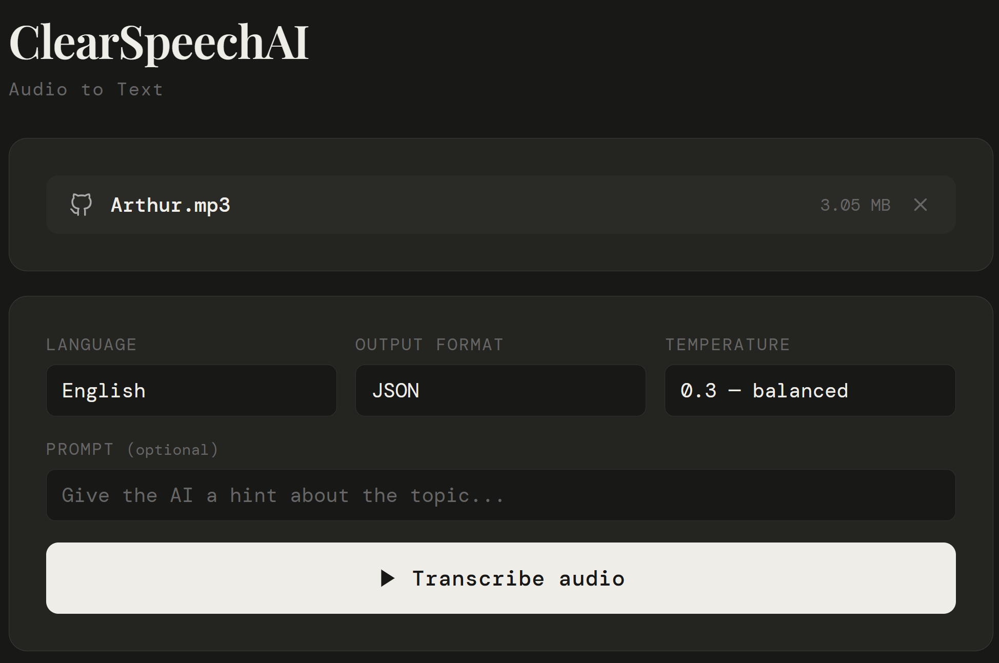

# ClearSpeechAI

🚧 **Project Status: Under Construction**  

ClearSpeechAI is a audio-to-text transcription app.

---

## 🎯 Project Overview

ClearSpeechAI focuses on:

- Experimenting with audio‑to‑text transcription
- Exploring Semantic Kernel’s audio processing capabilities
- Building a foundation for future AI‑driven speech tools
- Learning how to integrate LLM‑based audio workflows into .NET applications

---

## ⚙️ Configuration

The project uses a `.env` file in the `backend/ClearSpeechAI.API/` directory for configuration:

```env
OpenAI__ApiKey=your_api_key
OpenAI__AudioToTextModel=whisper-1
# Optional: Set a custom base URL for local Whisper services
# OpenAI__BaseUrl=http://localhost:8100
```

---

## 🤝 Contributions

Suggestions and ideas are welcome as the project grows.

---

## 📜 License

This project is intended for learning and experimentation.

---


